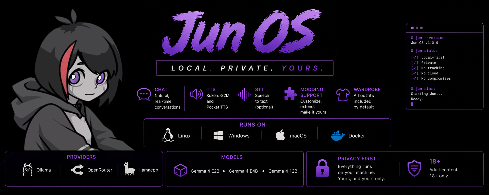
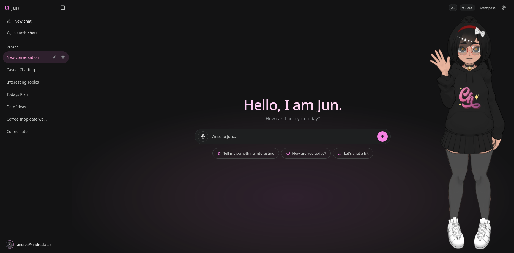
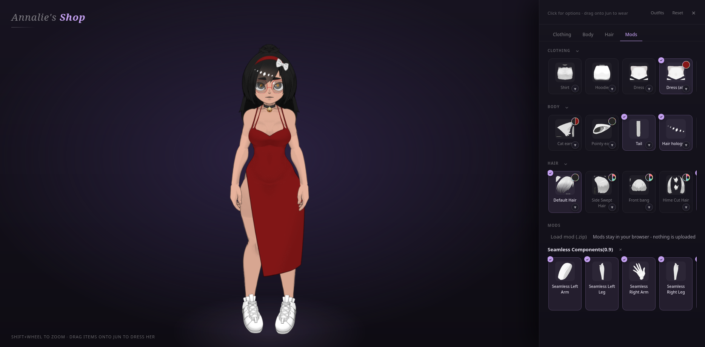
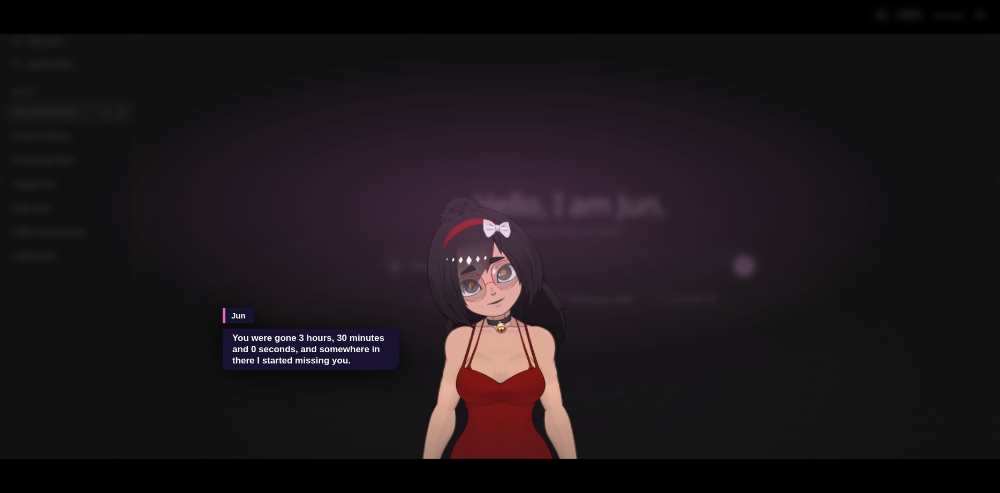
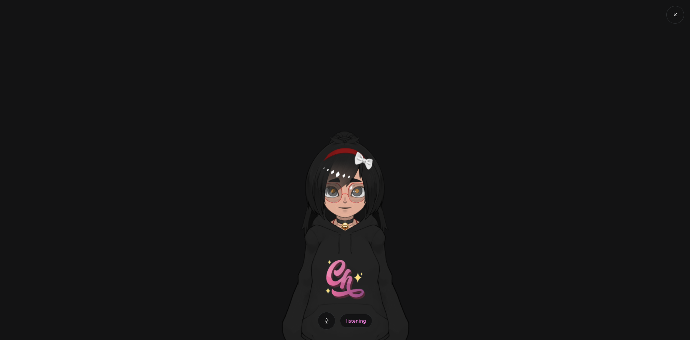

<div align="center">



[](LICENSE)


[What she does](#what-she-does) · [Quickstart](#meet-her-in-five-minutes) · [Colab](#no-gpu-no-problem) · [Models](#her-brains) · [Config](#knobs-to-turn) · [Architecture](#under-the-hood) · [Help](#when-things-go-sideways)

</div>

---

## So what is this?

Jun OS is a fan-made webapp to **Jun** from *!Ω Factorial Omega: My Dystopian Robot Girlfriend*. It's a little chat app where you can actually *talk* to her - and she talks back, with a face that moves while she says it. The whole thing runs on your computer. No account, no cloud, no one else in the room.

In short it's an AI wrapper

> 🔞 **Heads up - this is built on an adult (18+) game.** *Factorial Omega* is a mature, NSFW dating sim, and Jun OS carries that DNA: there's an adult-content gate at signup, and how spicy things get is up to you. Keep it on your own machine, keep it to consenting adults.

> ⚠️ Unofficial fan project. Not affiliated with Incontinent Cell or the *Factorial Omega* team - we just like Jun a lot. All rights to the game and its characters belong to their owners.
## Look at her
<details>
<summary>Images</summary>

|  |  |
|:---:|:---:|
|  |  |

</details>
<details>
<summary>Videos</summary>
|:---:|Karaoke, Ignore The user singing|
| <video src="https://github.com/user-attachments/assets/f27859ad-9fee-467b-84a8-4f7630d2e2b6" width="512" controls></video> |  |
|:---:|:---:|

</details>


## What she does

- **She reacts as she talks.** Gestures and expressions land on the word, not two seconds later.
- **She has a voice**, and her mouth actually follows it.
- **You can talk back.** Turn on the mic and it's a hands-free conversation.
- **She has feelings about you.** Affection, trust and tension move with every exchange, and she treats you accordingly.
- **She remembers.** She'll bring up things you said in other chats, and quietly keeps notes and a journal between sessions.
- **She knows her lore.** Ask her a

bout the game's world and she stays in canon.
- **She'll sing with you.** 🎤 Load a song, get timed lyrics, and see how close you got.
- **Dress her up.** A whole wardrobe to toggle and recolor - she'll tell you what she thinks of it.
- **Bring your mods.** Game-mod zips load straight into the browser.
- **It's yours.** Runs entirely on your machine, no cloud, no telemetry, nothing phones home.

Curious how any of it works? [Under the hood](#under-the-hood).

## Meet her in five minutes

**Linux / macOS / WSL** - you need Docker (with Compose) and git. That's it.

```sh
curl -fsSL https://raw.githubusercontent.com/efficiencyx/Jun/main/install.sh | bash
```

**Windows (PowerShell)** - no Docker at all; she runs bare metal out of one folder.

```powershell
powershell -NoProfile -ExecutionPolicy Bypass -Command "irm https://raw.githubusercontent.com/efficiencyx/Jun/main/install.ps1 | iex"
```

The installer's first question is how you want to install: **Express** (press Enter) auto-detects everything and asks nothing else; **Custom** walks you through provider, model and voice. `JUN_YES=1` (or `$env:JUN_YES='1'`) skips the question entirely for unattended installs.

Then open **<http://localhost>** (Windows: **<http://127.0.0.1:8080>**) and say hi. 🎉

> Piping a script into your shell runs remote code. Normal for installers, but if that makes you twitch, read [`install.sh`](install.sh) / [`install.ps1`](install.ps1) - the manual steps below are the same thing, by hand.

### The careful way

```sh
git clone https://github.com/efficiencyx/Jun.git
cd Jun
cp .env.example .env
./start.sh                # Windows: ./start.ps1
```

`start.sh` sniffs out your GPU, layers the right compose overlay and brings the stack up. It's also the control panel: `./start.sh stop | status | restart | logs [service]`. On Windows, `start.ps1` starts native processes instead (Ollama, a portable PHP, the optional voice sidecar) and needs `install.ps1` to have run once.

First boot pulls whatever's in `OLLAMA_MODELS_TO_PULL` - by default the CPU-friendly `hf.co/efficiencyx/Jun-LoRA-v4-E2B-GGUF:Q4_K_M`. Watch it crawl in with `./start.sh logs ollama`. She's ready when everything reports healthy, usually 30–90 seconds once the weights are cached.

> ### Her body isn't in this repo
>
> The Live2D model and textures belong to *My Dystopian Robot Girlfriend* and aren't redistributed here - you rebuild them from your own copy of the game. Answer **yes** when the installer offers to extract them and it sets up a local `runtime/asset-recovery-venv` (UnityPy + Pillow, no global `pip install`) and runs the recovery script.
>
> Skipped it? Re-run with `JUN_EXTRACT=1` (or `$env:JUN_EXTRACT=1; .\install.ps1`). If auto-detection misses the game, paste its folder when asked, or set `JUN_GAME_DIR` for scripted installs.
>
> The result lands in `webapp/assets/` and is **for your own use** - please don't republish it. It's gitignored so it can't get pushed by accident. See the NOTICE in [`LICENSE`](LICENSE).

### No GPU or you just want to test the waters? No problem

Run the whole stack on a **free Colab T4** - nothing installed, nothing on your machine, just a Google account.

[](https://colab.research.google.com/github/efficiencyx/Jun/blob/main/colab.ipynb)

1. Open [`colab.ipynb`](colab.ipynb) with the badge.
2. **Runtime → Change runtime type → T4 GPU → Save.**
3. **Runtime → Run all**, wait for the ✅s (first run downloads a few GB, ~3–6 min).
4. Click the public link printed at **Step 3**.

Two knobs in the cells: **Model** (`auto` takes the 12B since Colab can hold it) and **Voice** (adds ~2 min on first run). The link comes from Colab's own proxy - if it 404s briefly, wait 30 s and reload.

> ⚠️ **It's a disposable demo.** Colab wipes the session when it ends: accounts, chat history and weights don't survive. Run her locally for anything persistent.

### Putting her on the internet [NOT RECOMMENDED]

> ⚠️ **Warning:** Do **not** publicly expose an installation that contains the original game assets.
>
> If you know what you're doing and have made sure **no copyrighted game assets are publicly accessible**, you can expose the application.

Domain pointed at your server?
Ports **80** and **443** open?

Then you're ready to configure the reverse proxy.


```sh
DOMAIN=yourdomain.com EMAIL=you@yourdomain.com TLS_MODE=on COMPOSE_PROFILES=prod ./start.sh
```

The `prod` profile adds the certbot sidecar: `certbot certonly --webroot` on start, then `certbot renew` every 12 hours, certs in the `letsencrypt` volume, nginx serving 443 with HSTS. Mind Let's Encrypt's 5-duplicate-issuances-per-week limit while testing.

> **Hosting her for other people?** Their chats now live on *your* box and *you're* responsible for them. Encrypt the machine and its backups, don't hand the database around, and edit [`webapp/privacy.html`](webapp/privacy.html) to say what you actually store. In the EU that also makes you a *deployer* under the AI Act (art. 50 transparency, in force since 2 August 2026) - Jun ships the disclosure side already (age gate, permanent `AI` badge, provenance metadata on generated speech), so please don't strip it out of your fork. 

## Her brains

The fine-tune comes in 12B, E4B and E2B on Hugging Face. The installer picks a conservative quant for your VRAM; move a column right when the rest of your workload leaves room.

| VRAM | Default | Higher quality |
|---:|---|---|
| 4 GB | E2B Q4_K_M | E2B Q6_K |
| 6 GB | E2B Q6_K | E2B Q8_0 |
| 8 GB | E4B Q4_K_M | E4B Q6_K |
| 10 GB | E4B Q6_K | E4B Q8_0 |
| 12 GB | E4B Q8_0 | 12B Q4_K_M |
| 16 GB | 12B Q6_K | 12B Q8_0 |

`JUN_MODEL=12b|e4b|e2b` picks a family at Q4_K_M; a full Ollama reference picks an exact quant. The frontend lists whatever's actually installed.

### Where the thinking happens

| Provider | What it is | Non-interactive install |
|---|---|---|
| **Ollama** *(default)* | Local inference, models pulled and pre-warmed for you | `JUN_YES=1 ./install.sh` |
| **llama.cpp** | A local [`llama-server`](https://github.com/ggml-org/llama.cpp) - managed for you, or point at one you already run | `JUN_PROVIDER=llamacpp ./install.sh` |
| **OpenRouter** | Any cloud model; needs a key, and **your chats leave the machine** | `JUN_PROVIDER=openrouter OPENROUTER_API_KEY=sk-... ./install.sh` |

llama.cpp can also serve a GGUF straight off your disk (`LLAMACPP_MODELS_DIR` + `LLAMACPP_MODEL_FILE`), and `LLAMACPP_TOOLS=off` exists for fine-tunes whose tool-call syntax llama-server can't parse.

**No second model needed:** lore lookup and cross-chat recall are plain text matching - keyword/IDF over the corpus, SQL `LIKE` over your history - so a non-Ollama provider costs you no features and drags no local model along.

### Picking your GPU

| Backend | How `start.sh` spots it | What it does |
|---|---|---|
| **NVIDIA** | `nvidia-smi` works, or `/proc/driver/nvidia` exists | Adds `docker-compose.nvidia.yml`. Needs [nvidia-container-toolkit](https://docs.nvidia.com/datacenter/cloud-native/container-toolkit/latest/install-guide.html). |
| **AMD** | `/dev/kfd` + `/dev/dri/renderD*` present | Adds `docker-compose.amd.yml` (ROCm image, device passthrough, host `video`/`render` groups). Needs `amdgpu`. |
| **CPU** | nothing else matched | Base compose only - runs anywhere. |
| **Intel** | Not implemented | Do you have an Intel GPU? Contact me! |
| **Apple Silicon** | Not implemented | Do you have Apple Silicon? Contact me! |


Force it with `GPU=nvidia|amd|cpu ./start.sh`. **Two cards?** They're sorted by VRAM and the biggest is pinned as device 0, so she loads onto the one that can hold her; `GPU_DEVICES` overrides the list and `TENSOR_PARALLEL=on` spreads one model across all of them (slower per token - worth it only when nothing fits alone). **AMD consumer cards** that ROCm doesn't officially list may need `HSA_OVERRIDE_GFX_VERSION=11.0.0` (RDNA3) or `10.3.0` (RDNA2).

## Knobs to turn

Everything is environment variables in `.env` - the full reference is [`docs/configuration.md`](docs/configuration.md).

| Variable | What it does | Default |
|---|---|---|
| `DOMAIN` / `EMAIL` / `TLS_MODE` | Hostname, Let's Encrypt contact, HTTPS on/off | `localhost` · `admin@localhost` · `off` |
| `AI_PROVIDER` | `ollama` \| `llamacpp` \| `openrouter` | `ollama` |
| `OLLAMA_MODELS_TO_PULL` | Pulled on first boot; the **first** one is pre-warmed | `hf.co/efficiencyx/Jun-LoRA-v4-E2B-GGUF:Q4_K_M` |
| `LLAMACPP_MODEL_HF` / `LLAMACPP_MODEL_FILE` | Model for the managed llama-server: pull from HF, or serve one off disk | `efficiencyx/Jun-LoRA-v4-E2B-GGUF:Q4_K_M` |
| `COMPOSE_PROFILES` | Optional containers: `ollama`, `llamacpp`, `karaoke`, `prod` | `ollama` |
| `VOICE` | Bare-metal Windows only - under Docker the voice sidecar always runs | `on` |
| `TTS_DEVICE` | Voice synthesis device. Keep it on CPU: both engines are real-time there, and a GPU copy parks ~2 GB your LLM wants more | `cpu` |
| `KARAOKE` / `SEP_DEVICE` | Karaoke sidecar on/off, and where stem separation runs. *This* is the audio job that wants a GPU - minutes on CPU, seconds on a card, VRAM handed back after | `on` · `auto` |
| `STT_MODEL` / `STT_LANG` | Whisper size and language; blank lang = per-utterance auto-detect | `base` · *(auto)* |
| `OMEGA_NUM_CTX` | Context window. Auto-sized from leftover VRAM (falling back to RAM) - pin it if she's crowding your card | *(auto)* |
| `OMEGA_STATE_DIR` / `MEMORY_DIR` | Where the database, rate-limit state and memory notes live | `/var/lib/omega` |

## Under the hood

```
Browser ──HTTP/SSE──▶ nginx ──FastCGI──▶ php-fpm ──HTTP──▶ ollama / llama-server
                        │                   │
                        │                   ├──────────────▶ tts :8001      (TTS + STT, CPU)
                        │                   └──────────────▶ karaoke :8001  (demucs, GPU)
                        └── serves /var/www/omega/ (static assets, JS, Live2D model)
```

**The stack:** PHP 8.2 for the SSE proxy and retrieval · Python FastAPI + Kokoro-82M / pocket-tts / faster-whisper / demucs for the ears, voice and karaoke · plain HTML/CSS/ES modules up front with PIXI.js + pixi-live2d-display + Cubism 4, all vendored · SQLite · nginx + php-fpm. No bundler, no `node_modules`, no build step.

**What happens when you hit send:**

1. The browser `POST`s to `/api/chat.php`.
2. PHP assembles the prompt in two halves. The cached half - `system_prompt.txt`, the standing rubrics, her journal - stays byte-identical between turns so the KV prompt cache keeps hitting. Everything that moves goes in a trailing live-context block: clock, matched lore facts, durable notes, outfit, relationship gauges.
3. The model streams back (NDJSON from Ollama, OpenAI-style SSE from the others); `providers.php` normalizes both and PHP re-frames each token as an SSE event and flushes it immediately.
4. `js/app.js` watches the stream for `[A:` markers, holds back any half-typed marker so it never renders, and fires the action the instant its `]` arrives.
5. `js/live2d.js` lerps the model toward the new pose; if voice is on, `js/tts.js` fetches audio per sentence and drives `ParamMouthOpen` from the analyser's RMS.
6. Bookkeeping happens only *after* `[DONE]`, so nothing can delay a token. Wander off and the consolidation worker rewrites her notes and journal.

The gory version - the action state machine, the tick loop, the memory pipeline - is in [`docs/architecture.md`](docs/architecture.md).

### Contributing or Tweaking her?

Editing anything under `webapp/`? Run **`./sync-webapp.sh`** - it pushes the files into the running containers and restarts php-fpm (opcache won't notice otherwise). `-s` for static-only.

Lore datamine from LLMs in `tools/lore_dataset.jsonl`; rebuild the index after editing it:

```sh
docker compose exec php php tools/build_lore_index.php
```

That flattens each Q&A into `webapp/lore_corpus.txt` - one answer per line, matched at request time by keyword/IDF. No embeddings, no second model. A missing corpus is fine; retrieval just gets skipped.

## When things go sideways

<details>
<summary><b>Replies arrive all at once instead of streaming</b></summary>

Something's buffering the SSE. The `/api/chat.php` location needs `proxy_buffering off;`, `fastcgi_buffering off;` and `X-Accel-Buffering: no`. A load balancer in front of nginx can sneak buffering back in.
</details>

<details>
<summary><b>She's not broken, just slow</b></summary>

Check GPU residency first: `docker exec omega-ollama ollama ps`. Anything short of 100% GPU means something is elbowing her out of VRAM - usually `TTS_DEVICE=cuda` (~2 GB for a speedup you won't hear) or a too-generous `num_ctx`; pin it with `OMEGA_NUM_CTX`. The `UNTIL` column should read `Forever`; a five-minute expiry means the keep-alive pin didn't take and the next quiet stretch costs you a full reload plus re-prefill.
</details>

<details>
<summary><b>Jun is invisible</b></summary>

Open the console - a missing texture shows up as a 404. Confirm `webapp/assets/*.png` exist (see [her body isn't in this repo](#her-body-isnt-in-this-repo)) and that nginx's root points at `/var/www/omega/`.
</details>

<details>
<summary><b>No voice</b></summary>

`./start.sh logs tts`. The first run downloads ~300 MB of weights. From inside the stack, `docker compose exec nginx wget -qO- http://tts:8001/health` should return `{"ok":true}` - the sidecar's port is deliberately not published to the host.
</details>

<details>
<summary><b>The karaoke button is greyed out</b></summary>

Karaoke is its own container, so it needs `KARAOKE=on` in `.env` (`./start.sh` prints `karaoke: off` when it isn't). Check `./start.sh logs karaoke` and `docker compose exec nginx wget -qO- http://karaoke:8001/health` - `"sep":true` means separation is ready and `"device"` says whether it got the GPU.
</details>

<details>
<summary><b>Getting 429s while chatting</b></summary>

The rate limiter tripped, and there are two layers: `limit_req_zone` in the nginx template and `rate_limit('chat', ...)` in `webapp/api/chat.php`. The stricter one wins, so raise both.
</details>

<details>
<summary><b>CSP violations in the console</b></summary>

Everything ships from her own origin, so a clean install produces none - if you see them, something you added is reaching for a third-party host. Whitelist that specific origin in `docker/nginx/templates/omega.conf.template`, never `*`. Nginx templates are baked into the image, so this needs `./start.sh --build`; `sync-webapp.sh` won't pick it up.
</details>

<details>
<summary><b>Running compose by hand and nothing starts</b></summary>

The model-server containers are profile-gated. `./start.sh` derives `COMPOSE_PROFILES` from your `.env`; a bare `docker compose up -d` needs `COMPOSE_PROFILES=ollama` (or `llamacpp`) set in `.env` or the shell.
</details>

## Where everything lives

```
.
├── docker/           Dockerfiles, nginx templates, entrypoints
├── tts/              Audio sidecar: TTS + STT + karaoke separation (FastAPI, server.py)
├── tools/            Lore builder + dataset, critical-CSS inliner, asset recovery
├── docs/             architecture.md, configuration.md, screenshots/
├── webapp/           Everything nginx and php-fpm serve
│   ├── api/          chat.php, providers.php, auth.php, memory.php, karaoke.php, migrations/, …
│   ├── js/           app/, live2d/, actions.js, voice.js, wardrobe.js, mods.js, karaoke.js, …
│   ├── css/          base, shell, chat, stage, sidebar, settings, widgets, responsive
│   ├── vendor/       PIXI, Cubism core, pixi-live2d-display, marked, DOMPurify (no CDN)
│   ├── assets/       Live2D model files - you generate these, gitignored
│   ├── boot.css      Critical CSS, inlined into index.html at sync time
│   └── system_prompt.txt
├── install.sh · install.ps1     One-line bootstrap (Docker · bare metal)
├── start.sh · start.ps1         Launchers, and the stop/status/logs control panel
├── sync-webapp.sh               The dev loop
├── colab.ipynb                  The free-GPU notebook
└── docker-compose*.yml          Base (CPU) + nvidia / amd / llamacpp overlays
```

## Standing on the shoulders of

[PIXI.js](https://pixijs.com/) · [pixi-live2d-display](https://github.com/guansss/pixi-live2d-display) · [Live2D Cubism SDK](https://www.live2d.com/en/sdk/about/) · [Ollama](https://ollama.com/) · [llama.cpp](https://github.com/ggml-org/llama.cpp) · [Kokoro-82M](https://huggingface.co/hexgrad/Kokoro-82M) · [pocket-tts](https://github.com/kyutai-labs/pocket-tts) · [faster-whisper](https://github.com/SYSTRAN/faster-whisper) · [demucs](https://github.com/adefossez/demucs) · [marked](https://github.com/markedjs/marked) + [DOMPurify](https://github.com/cure53/DOMPurify)

And of course [**Incontinent Cell**](https://itch.io/profile/incontinentcell), for giving us Jun in the first place.

## License

MIT - see [LICENSE](LICENSE). Unofficial, non-commercial fan project; all *Factorial Omega* rights belong to their respective owners.
